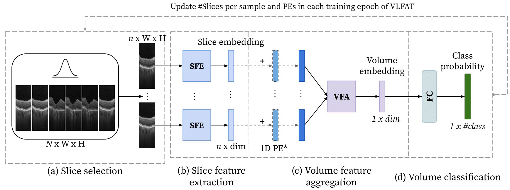

# VLFAT
This repository contains the source code of the following paper that is accepted for MICCAI 2023(Available at  [arXiv](http://arxiv.org/abs/2307.06666)):
**Transformer-based end-to-end classification of variable-length volumetric data**, Marzieh Oghbaie, Teresa Araujo, Taha Emre, Ursula Schmidt-Erfurth, Hrvoje Bogunovic

The proposed network deploys Transformers for volume classification that is able to handle variable volume resolutions both at development and inference time.  
## Proposed Approach for 3D volume Classification


The main models are available at `model_zoo/feature_extrc/models.py`.


## Installation
Please check [INSTALL.md](INSTALL.md) for installation instructions. 

## Training
For OLIVES dataset, the list of samples should be provided in a `.csv` file under `dataset` to `annotation_path_test` field. The file should at least includes `sample_path`,`FileSetId`,`label`,`label_int`,`n_frames`.
On Duke dataset, however, give the directory of the samples arranged like the following to the dataloader is sufficient: `subset/class`.
```shell
python main/Smain.py --config_path config/YML_files/VLFAT.yaml
```

## Evaluation
- Simple Test with confusion matrix: set the `train: false` and `allow_size_mismatch: false` under `train_config` in the corresponding config file.
 
```shell
python main/Smain.py --config_path config/YML_files/FAT.yaml 
```

- Calculate AUC of all the models. A list of the corresponding configs should be provided:
```shell
python main/Stest_AUC.py
```

- Robustness Analysis: The test is run for `num_test` under `model_inputs` in the corresponding config file and the results are saved in the corresponding `log` file. This test only works for  
```shell
python main/Stest_robustness.py --config_path config/YML_files/VLFAT.yaml
```
Note that the list of possible volume resolutions can be changed in the `main/Stest_robustness.py` file (e.g. `volume_resolutions = [5, 15, 25, 35, 45]`).


## Acknowledgement
This repository is built using the [timm](https://github.com/rwightman/pytorch-image-models) library, [Pytorch](https://pytorch.org) and [Meta Research](https://github.com/facebookresearch) repositories.

## License
This project is released under the MIT license. Please see the [LICENSE](LICENSE) file for more information.

## Citation

